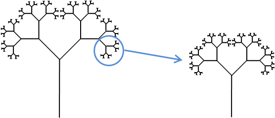
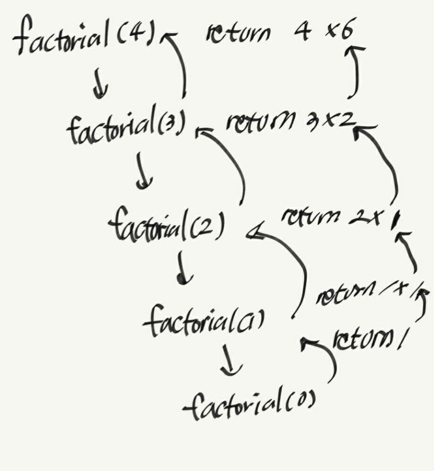

# Algorithm and Data Structure 04. Recursion(재귀)

 재귀란 함수가 실행되는 동안 자기 자신을 한 번 이상 호출하거나, 같은 형태의 작은 객체를 재현하는 기술을 말합니다.  재귀의 예로는 프랙탈, 러시안 인형 등이 있습니다. 

 


아래 네 개의 예제를 구현하며 재귀에 대해 공부하도록 합니다.

- Factorial Function 
- English Ruler
- Binary Search
- File System

## 04.01 Illustrative Examples

### 04.01.01 The Factorial Function

$$
{
n! = \begin{cases} 1 \qquad\qquad\qquad   \,\mbox{if } n\mbox{   =0}\\n * (n-1) \qquad\mbox{if}\,\,\mbox{n}\ge1\end{cases}
}
$$

팩토리얼 함수는 다음과 같은 두 가지 이유로 재귀의 일종이라 할 수 있습니다.

- n =0 인 경우의 base case 를 가지고 있음.
- 한 번 이상의 recursive case 를 가지고 있음.

팩토리얼 함수는 아래와 같은 코드로 구현할 수 있습니다.

```python
def factorial(n):
	if n == 0:
		return 1 # base case
	else:
		return n * factorial(n - 1) # one or more recursive cases
```

위의 코드는 절대 반복문을 사용하지 않지만, 함수의 재귀적인 호출로 반복이 구현됩니다.

또한 위의 코드는 순환적인 구조를 가지지 않습니다. 점점 작은 수로 호출되면서 base case(n = 0)에 도달하면 함수의 호출을 멈추기 때문입니다.




위와 같은 그림을 recursion trace라고 합니다.  이는 프로그래밍 언어에서 어떤 식으로 재귀의 실행이 이뤄지는지 보여줍니다. 

파이썬의 경우 **activation record** 또는 **frame** 이라는 함수의 호추에 관한 정보를 저장하는 structure(구조체?)가 생성됩니다. 여기에는 함수를 호출한 매개변수와, 함수에 사용되는 지역변수가 기록되고 함수의 어떤 부분이 실행되고 있는지에 대한 정보가 포함됩니다. 함수의 실행이 중첩된 함수를 호출할 때, 이전 함수의 실행은 유보되고 **151페이지 분석 보류**


### 04.01.02 Drawing an English Ruler

 04.0.2 factorial function에서는 굳이 재귀를 써야 하는 큰 이유를 찾지 못 했습니다. 

```python
def factorial(n):
    result = 1
    for i in range(n):
        result = reuslt * (i + 1)
    return result
```

사실 위와 같이 반복문으로 코드를 구성해도 같은 시간 복잡도를  보인다는 점에서 그렇습니다. 조금 더 복잡한 재귀의 예인 English Ruler에 대해 알아보겠습니다. 요구 사항은 아래와 같습니다.

- 매 인치마다 숫자로 된 라벨을 적을 것. 
- 1/2 인치, 1/4인치... 를 표시해줄 것.
- 구간의 길이가 줄어들 수록, tick의 길이를 하나씩 줄일 것.

구현해야 할 내용을 그림으로 표현하면 아래와 같습니다.


 (b)를 보며 이야기해보겠습니다. 매 인치의 눈금마다 숫자가 표시돼있습니다. 1/2인치 지점에선 4의 길이를 가집니다. 그리고 4의 길이를 가지는 눈금의 위 아래는 동일하게 3의 길이를 가지는 눈금이 있습니다. L>1인 눈금들을 보면 다음과 같은 규칙이 반복됩니다.

- 중앙 눈금의 길이가 L - 1인 구간
- L의 길이를 가지는 눈금
- 중앙 눈금의 길이가 L - 1인 구간

이를 함수로 구현해보면 아래와 같습니다.

```python
def draw_line(tick_length, tick_label=''):
    '''Draw one line with given tick length (followed by optional label).'''
    line = '-' * tick_length
    if tick_label:
        line += ' ' + tick_label
    print(label)

def draw_interval(center_length):
    '''Draw tick interval based upon a central tick length.'''
    if center_length:
        draw_interval(center_length - 1)
        draw_line(center_length)
        draw_interval(center_length - 1)
        
def draw_ruler(num_inches, major_length):
    '''Draw English ruler with given number of inches, major tick length.'''
    draw_line(major_length, '0') # 우선 0의 눈금을 하나 출력합니다.
    for j in range(1, 1 + num_inches):
        draw_interval(major_length - 1)
        draw_line(major_length, str(j))
```

draw_ruler함수는 메인함수의 역할을 합니다. 자의 길이를 정하여 draw_interval함수와 draw_line함수를 반복하여 호출에 자를 출력합니다. draw_line함수는 눈금을 그려주는 함수입니다.  tick_label 인자에 입력이 있을 경우, 눈금 옆에 숫자를 출력합니다. draw_interval함수는 center_length의 길이가 1 이상이면 L - 1 의 center_length를 가지는 구간, center_length의 길이를 가지는 눈금, L - 1의 center_length를 가지는 구간을 출력합니다. 


### 04.01.03 Binaray Search

 이번 단원에선 Binary Search(이분 탐색)에 대해 알아볼 겁니다. 이는 n 개의 원소를 가지는 정렬된 리스트에서 효율적으로 특정 값의 위치를 찾는 데에 자주 사용됩니다. 원소가 정렬되지 않은 리스트에서 특정 원소의 위치를 찾는다면 최악의 경우 n 개의 원소를 모두 조회해야 하므로 O(n)의 시간 복잡도를 가집니다. 

 

 만약 원소가 정렬되어 있다면, 훨씬 효율적인 방법이 존재합니다. 우리는  j번째 원소에 대해 0 ~ j - 1번째 원소는 j번째 원소의 값보다 작거나 같은 값을 가질 것을 압니다. 또 j  + 1 ~ n - 1번째 원소는 j번째 원소의 값보다 크거나 같은 값을 가질 것을 압니다.  j번째 원소는 "후보"로 부르겠습니다. 우리는 이 "후보"가 우리가 위치를 찾는 원소(이하 target)일 가능성을 배제할 수 없습니다. 이 알고리즘은 high, low 두 개의 원소를 가집니다.  리스트의 모든 원소는 high보다 작거나 같고, low보다 크거나 같습니다. 우리는 그 뒤 high와 low의 중간값과 target 값의 대소를 비교합니다.  이 때, 세 개의 케이스를 고려할 수 있습니다.

- list[mid]와 target의 값이 같으면, 우린 target을 성공적으로 찾은 것입니다.
- list[mid] > target이면 low는 그대로 두고 high를 mid - 1로 초기화합니다.
- list[mid] < target이면 high는 그대로 두고 low를 mid + 1로 초기화합니다.

```python
# 내 코드
def binary_search(data, target, low, high):
    mid = (low + high) // 2
    if data[mid] == target:
        print("{} is positioned at {}".format(target, mid)) # DEBUG
    elif data[mid] > target:
        print("{} is larger than {}".format(data[mid], target)) # DEBUG
        high = mid - 1
        binary_search(data, target, low, high)
    else:
        print("{} is smaller than {}".format(data[mid], target)) # DEBUG
        low = mid + 1
        binary_search(data, target, low, high)
        
def binary_search(data, target, low, high):
    if low > high:
        return False
   	else:
        mid = (low + high)//2
        if target == data[mid]:
            return True
        elif target < data[mid]:
            return binary_search(data, target, low, mid - 1)
        else:
            return binary_searc(data, target, mid + 1, high)

data = [2, 4, 5, 7, 8, 9, 12, 14, 17, 19, 22, 25, 27, 28, 33, 37]
binary_search(data, 27, 0, len(data) - 1)
'''
14 is smaller than 27
25 is smaller than 27
28 is larger than 27
27 is positioned at 12
'''
```

위의 코드와 같은 알고리즘을 binary_search라고 부릅니다. 앞서 말한 순차 탐색의 경우 O(n)의 시간 복잡도를 가지지만, 이는 O(logn)의 시간복잡도를 가집니다. data의 개수가 100만개라고 하면, O(n)의 시간복잡도를 가진다면 100만 회 반복하지만, O(logn)은 30번만에 특정 값의 위치를 찾을 수 있게 됩니다. 


 

